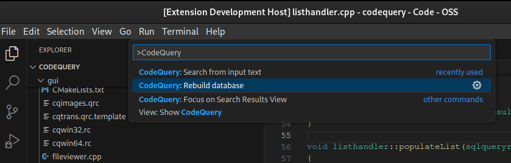
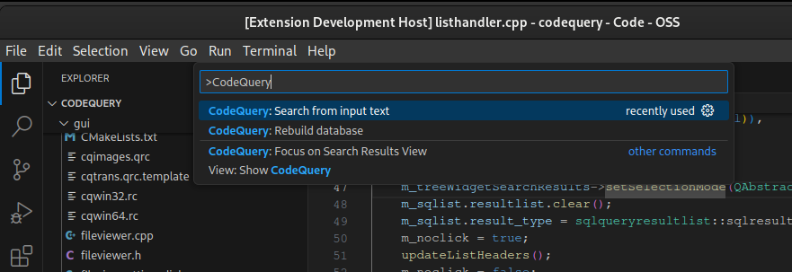
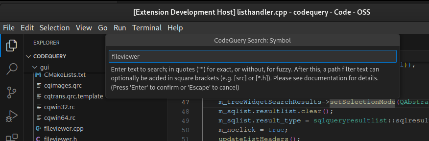
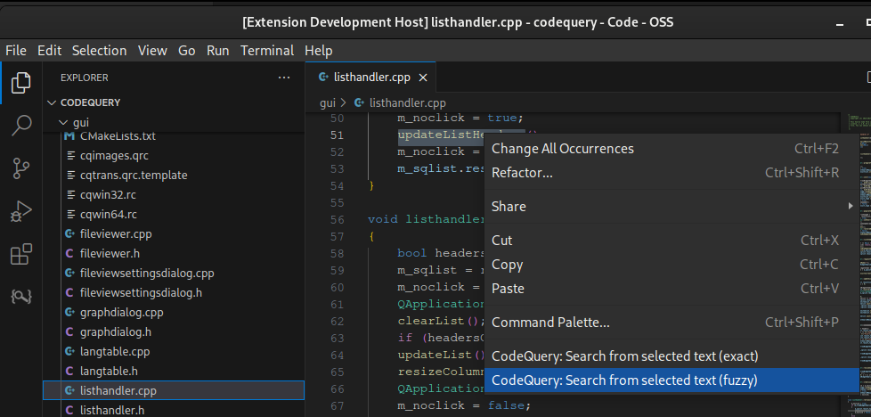
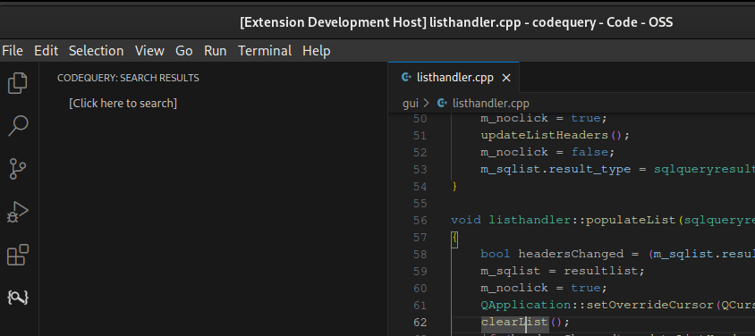

============================================

This is a Visual Studio Code Extension (or plugin) for [CodeQuery](https://github.com/ruben2020/codequery).

The [Visual Studio Code Extension Marketplace](https://marketplace.visualstudio.com/VSCode) page for this extension is [ruben2020.codequery4vscode](https://marketplace.visualstudio.com/items?itemName=ruben2020.codequery4vscode).

[CodeQuery](https://github.com/ruben2020/codequery) is a tool to index, then query or search C, C++, Java, Python, Ruby, Go and Javascript source code.

It builds upon the databases of [cscope](http://cscope.sourceforge.net/) and [Exuberant ctags](http://ctags.sourceforge.net/). It can also work with [Universal ctags](https://github.com/universal-ctags/ctags/), which is a drop-in replacement for Exuberant ctags.

The databases of cscope and ctags would be processed by the `cqmakedb` tool to generate the CodeQuery database file. The tool cscope only works with C, C++ and Java. The database of cscope can also be generated by [pycscope](https://github.com/portante/pycscope) for Python and [starscope](https://github.com/eapache/starscope) for Ruby, Go and Javascript.

The CodeQuery database file can be queried on Visual Studio Code using this extension. This Visual Studio Code Extension makes use of Codequery CLI tool `cqsearch` to perform the queries.


## Latest version = 0.8.0

Please read [CHANGELOG](CHANGELOG.md) to discover the latest changes in this release.


## What types of query can I make with this extension?

* Symbol
* Function or macro definition
* Class or struct
* Functions calling this function
* Functions called by this function
* Calls of this function or macro
* Class which owns this member or method
* Members and methods of this class
* Parent of this class (inheritance)
* Children of this class (inheritance)
* Files including this file


## What does it cost? How is it licensed?

This software is freeware and free open source software. It can be used in a commercial environment for free, for an unlimited period of time. The same applies to [CodeQuery](https://github.com/ruben2020/codequery).

This software is licensed under the MIT License. Please see the [LICENSE](LICENSE) file for more details.


## Which platforms are supported?

It has been tested on Visual Studio Code in Linux 64-bit and Windows 10 64-bit. It should work on Mac without any problems, similar to how it works on Linux.


## What are the prerequisites or dependencies that I must install, before installing this extension?

You need to install the following:

* [Visual Studio Code](https://code.visualstudio.com/), of course
* [CodeQuery](https://github.com/ruben2020/codequery)
* Other tools to support CodeQuery like [cscope](http://cscope.sourceforge.net/), [ctags](http://ctags.sourceforge.net/), [pycscope](https://github.com/portante/pycscope) or [starscope](https://github.com/eapache/starscope), depending on your specific need.

If you have installed CodeQuery correctly, `cqsearch` should be accessible on a terminal window from any folder i.e. it's on PATH. This is required.


## How do I install this extension?

The [Visual Studio Code Extension Marketplace](https://marketplace.visualstudio.com/VSCode) page for this extension is [ruben2020.codequery4vscode](https://marketplace.visualstudio.com/items?itemName=ruben2020.codequery4vscode).

In Visual Studio Code, click on the Extension button on the left panel (or alternatively, press Ctrl+Shift+X) and then search for "codequery4vscode". After this, click on the Install button.

Alternatively, in Visual Studio Code, press Ctrl+P, then enter `ext install ruben2020.codequery4vscode`, and press Enter.


## How do I prepare my source code for use with this extension?

Let's assume that the base folder of your source code is `[project_base_path]`.

The extension will look for the CodeQuery database in `[project_base_path]/.vscode/codequery/cq.db` exactly.

The CodeQuery database can be rebuilt by the extension using either a Bash script in `{project_base_path}/.vscode/codequery/rebuild.sh` or a Windows batch file in `{project_base_path}/.vscode/codequery/rebuild.bat`.

The Bash script or Windows batch file can be called manually or through the codequery4vscode Visual Studio Code extension. It's meant to be executed when the current working directory is `[project_base_path]`

Let me provide an example here on how to prepare the source code of CodeQuery itself.

In Linux or Mac, follow these steps for C/C++ source code:

```bash
cd ~/repo
git clone https://github.com/ruben2020/codequery.git
cd codequery
mkdir -p .vscode/codequery
```

Here, `[project_base_path]` is `~/repo/codequery`.

Then create the script `~/repo/codequery/.vscode/codequery/rebuild.sh` with these contents using vim, gedit or your favorite editor:

```bash
#!/bin/bash
rm -f .vscode/codequery/cscope.out
rm -f .vscode/codequery/tags
find . -iname "*.h"    > .vscode/codequery/cscope.files
find . -iname "*.hpp" >> .vscode/codequery/cscope.files
find . -iname "*.hxx" >> .vscode/codequery/cscope.files
find . -iname "*.hh"  >> .vscode/codequery/cscope.files
find . -iname "*.c"   >> .vscode/codequery/cscope.files
find . -iname "*.cpp" >> .vscode/codequery/cscope.files
find . -iname "*.cxx" >> .vscode/codequery/cscope.files
find . -iname "*.cc"  >> .vscode/codequery/cscope.files
cscope -cb -i .vscode/codequery/cscope.files -f .vscode/codequery/cscope.out
ctags --fields=+i -n -L .vscode/codequery/cscope.files -f .vscode/codequery/tags
cd .vscode/codequery
cqmakedb -s cq.db -c cscope.out -t tags -p -d
```

And then make it executable:

```bash
chmod +x ~/repo/codequery/.vscode/codequery/rebuild.sh
```

You can test the script by calling:

```bash
cd ~/repo/codequery/
./.vscode/codequery/rebuild.sh
```

In Windows, follow these steps for C/C++ source code:

```bash
cd c:\repo
git clone https://github.com/ruben2020/codequery.git
cd codequery
md .vscode
md .vscode\codequery
```

Then create the Windows batch file `c:\repo\codequery\.vscode\codequery\rebuild.bat` with these contents using Notepad or your favorite editor:

```bash
del /Q /F .vscode\codequery\cscope.out
del /Q /F .vscode\codequery\tags
dir /b/a/s *.h    > .vscode\codequery\cscope.files
dir /b/a/s *.hpp >> .vscode\codequery\cscope.files
dir /b/a/s *.hxx >> .vscode\codequery\cscope.files
dir /b/a/s *.hh  >> .vscode\codequery\cscope.files
dir /b/a/s *.c   >> .vscode\codequery\cscope.files
dir /b/a/s *.cpp >> .vscode\codequery\cscope.files
dir /b/a/s *.cxx >> .vscode\codequery\cscope.files
dir /b/a/s *.cc  >> .vscode\codequery\cscope.files
cscope -cb -i .vscode\codequery\cscope.files -f .vscode\codequery\cscope.out
ctags --fields=+i -n -L .vscode\codequery\cscope.files -f .vscode\codequery\tags
cd .vscode\codequery
cqmakedb -s cq.db -c cscope.out -t tags -p -d
```

You can test the Windows batch file by calling the following on a command terminal window:

```bash
cd c:\repo\codequery
.vscode\codequery\rebuild.bat
```

Please replace the wildcard expressions above with *.java, *.py, *.rb, *.go and *.js respectively for Java, Python, Ruby, Go and Javascript. Details can be found on the [CodeQuery](https://github.com/ruben2020/codequery) page.

You may also want to add `.vecode` to the `.gitignore` file on the base folder of your source code.


## How do I build or rebuild the CodeQuery database using this extension on Visual Studio Code?

First, open the Command Palette using Ctrl+Shift+P. Alternatively, click `View` on the Visual Studio Code menu, then select `Command Palette...`.

You will then see this:


Next, type "CodeQuery" into the inputbox. It will narrow down the results. Select `CodeQuery: Rebuild database`.



It could take a while to complete depending on the number of source code files to index. It will show a pop-up stating if the database rebuild was successful or failed.

If `{project_base_path}/.vscode/codequery/rebuild.sh` (in Linux or Mac) or `{project_base_path}/.vscode/codequery/rebuild.bat` (in Windows) cannot be found or cannot be executed (due to insufficient permissions), an error notification will pop-up.


## How do I search or query my code using this extension on Visual Studio Code?

First, open the base folder of your source code by clicking on `File` on the menu of Visual Studio Code, followed by selecting `Open Folder...`. Alternatively, press Ctrl+K Ctrl+O. If I use the same example as before, this refers to `C:\repo\codequery` on Windows or `/home/johndoe/repo/codequery` on Linux, assuming your username on Linux is johndoe.

There are 3 ways to search or query code using this extension:

* Method 1: Accessing codequery4vscode from the Command Palette, then typing a search phrase into an inputbox
* Method 2: Selecting text of code from a file, and using that to search, from the right-click dropdown menu
* Method 3: Clicking on the `[Click here to search]` line on the codequery4vscode treeview, and then typing a search phrase into an inputbox

The next sections show these.


## Method 1 for searching or querying code

First, open the Command Palette using Ctrl+Shift+P. Alternatively, click `View` on the Visual Studio Code menu, then select `Command Palette...`.

You will then see this:


Next, type "CodeQuery" into the inputbox. It will narrow down the results. Select `CodeQuery: Search from input text`.



Next, it will show you a quickpick menu with a list of possible search types. In this example, we select `1: Symbol`.


Next, it will show you an inputbox, where you can type a search phrase. In this example, we typed `fileviewer` for fuzzy search. Then press Enter.

For exact string search (including case sensitive), please enclose the search term in quotes like this: `"fileviewer"`.

The path filter can be included in square brackets after the search term.

To search for the term `fileviewer` as fuzzy search, but restrict it to source code files below the `gui` folder, type in `fileviewer[gui]`. To search for the term `fileviewer` as fuzzy search, but restrict it to `*.h` files only, type in `fileviewer[*.h]`.

To search for the term `fileviewer` as exact term search, but restrict it to source code files below the `gui` folder, type in `"fileviewer"[gui]`. To search for the term `fileviewer` as exact term search, but restrict it to `*.h` files only, type in `"fileviewer"[*.h]`.



After this, the search results will be shown. How to browse the search results will be explained below.


## Method 2 for searching or querying code

First, open a source file from the current project or folder in Visual Studio Code, then make a text selection using the mouse or keyboard, by highlighting some text. In this example, we highlighted "updateListHeaders" in listhandler.cpp, at line 51.

After this, right-click and a dropdown menu will appear. Select `CodeQuery: Search from selected text (fuzzy)` for fuzzy search, or `CodeQuery: Search from selected text (exact)` for exact string search (including case sensitive).



Next, it will show you a quickpick menu with a list of possible search types. In this example, we select `1: Symbol`.


After this, the search results will be shown. How to browse the search results will be explained below.


## Method 3 for searching or querying code

First, click the CodeQuery icon on the leftmost panel. This will reveal the codequery4vscode treeview on the left side.



After this, click on `[Click here to search]` on the codequery4vscode treeview.

Next, it will show you a quickpick menu with a list of possible search types. In this example, we select `1: Symbol`.


Next, it will show you an inputbox, where you can type a search phrase. In this example, we typed `fileviewer` for fuzzy search. Then press Enter.

For exact string search (including case sensitive), please enclose the search term in quotes like this: `"fileviewer"`.

The path filter can be included in square brackets after the search term.

To search for the term `fileviewer` as fuzzy search, but restrict it to source code files below the `gui` folder, type in `fileviewer[gui]`. To search for the term `fileviewer` as fuzzy search, but restrict it to `*.h` files only, type in `fileviewer[*.h]`.

To search for the term `fileviewer` as exact term search, but restrict it to source code files below the `gui` folder, type in `"fileviewer"[gui]`. To search for the term `fileviewer` as exact term search, but restrict it to `*.h` files only, type in `"fileviewer"[*.h]`.


After this, the search results will be shown. How to browse the search results will be explained below.


## How to browse the search results?

The search results will be shown on the codequery4vscode treeview on the left side. A summary of the search results is shown on top.

Below that, a list of files where the search results appear in, would be shown.


Select a file on the list to expand it, then select a line which represents a result. In this example, we selected `cli/main_cli.cpp` and selected the line `181: if (resultlst.result_type == sqlquery...`.  Then the file main_cli.cpp will be opened and it will reveal line 181. Select other files and lines to see more results.


The above is based on the search type of `1: Symbol`.

Click on `[Search again with another type]` under Search Summary, to repeat the search but to select a different search type.

Next, it will show you a quickpick menu with a list of possible search types. In this example, we select `3: Class or Struct`.


Next, the results will be updated as follows.


## How do I contact the authors for support, issues, bug reports, fix patches, feature requests etc.?

Please see the email address below, and also the Issues tab in GitHub.

Email address:    


Website: [codequery4vscode website](https://github.com/ruben2020/codequery4vscode)


## How can I contribute?

* Report bugs
* Provide feedback, new ideas, suggestions etc. What would you like to see?
* Tell your friends, recommend it on StackOverflow or social media
* Fix bugs (see Issues tab)
* Give us a good rating and review at the [Visual Studio Code Extension Marketplace](https://marketplace.visualstudio.com/VSCode) page [ruben2020.codequery4vscode](https://marketplace.visualstudio.com/items?itemName=ruben2020.codequery4vscode)


## List of Contributors

[ruben2020](https://github.com/ruben2020)      
(More welcomed)

