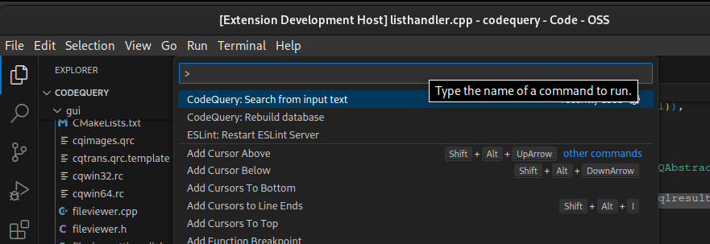
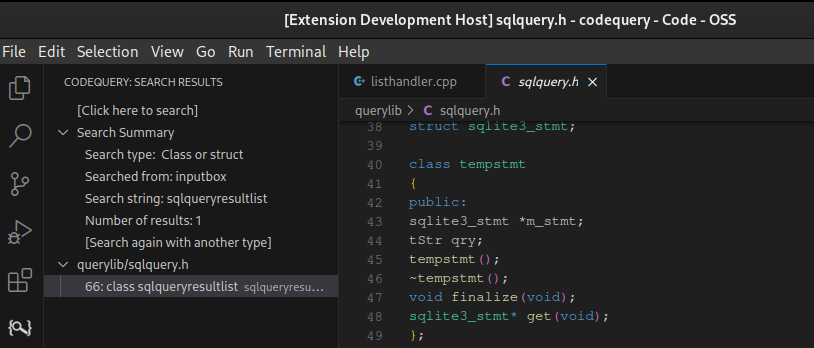

============================================

This is a Visual Studio Code Extension (or plugin) for [CodeQuery](https://github.com/ruben2020/codequery).

The [Visual Studio Code Extension Marketplace](https://marketplace.visualstudio.com/VSCode) page for this extension is [ruben2020.codequery4vscode](https://marketplace.visualstudio.com/items?itemName=ruben2020.codequery4vscode).

[CodeQuery](https://github.com/ruben2020/codequery) is a tool to index, then query or search C, C++, Java, Python, Ruby, Go and Javascript source code.

It builds upon the databases of [cscope](http://cscope.sourceforge.net/) and [Exuberant ctags](http://ctags.sourceforge.net/). It can also work with [Universal ctags](https://github.com/universal-ctags/ctags/), which is a drop-in replacement for Exuberant ctags.

The databases of cscope and ctags would be processed by the `cqmakedb` tool to generate the CodeQuery database file. The tool cscope only works with C, C++ and Java. The database of cscope can also be generated by [pycscope](https://github.com/portante/pycscope) for Python and [starscope](https://github.com/eapache/starscope) for Ruby, Go and Javascript.

The CodeQuery database file can be queried on Visual Studio Code using this extension. This Visual Studio Code Extension makes use of Codequery CLI tool `cqsearch` to perform the queries.


## Latest version = 0.3.0

Please read [CHANGELOG](CHANGELOG.md) to discover the latest changes in this release.


## What types of query can I make with this extension?

* Symbol
* Function or macro definition
* Class or struct
* Functions calling this function
* Functions called by this function
* Calls of this function or macro
* Class which owns this member or method
* Members and methods of this class
* Parent of this class (inheritance)
* Children of this class (inheritance)
* Files including this file


## What does it cost? How is it licensed?

This software is freeware and free open source software. It can be used in a commercial environment for free, for an unlimited time. The same applies to [CodeQuery](https://github.com/ruben2020/codequery).

This software is licensed under the MIT License. Please see the [LICENSE](LICENSE) file for more details.


## Which platforms are supported?

It has been tested on Visual Studio Code in Linux 64-bit and Windows 10 64-bit. It should work on Mac without any problems, similar to how it works on Linux.


## What are the prerequisites or dependencies that I must install, before installing this extension?

You need to install the following:

* [Visual Studio Code](https://code.visualstudio.com/), of course
* [CodeQuery](https://github.com/ruben2020/codequery)
* Other tools to support CodeQuery like [cscope](http://cscope.sourceforge.net/), [ctags](http://ctags.sourceforge.net/), [pycscope](https://github.com/portante/pycscope) or [starscope](https://github.com/eapache/starscope), depending on your specific need.

If you have installed CodeQuery correctly, `cqsearch` should be accessible on a terminal window from any folder i.e. it's on PATH. This is required.


## How do I install this extension?

The [Visual Studio Code Extension Marketplace](https://marketplace.visualstudio.com/VSCode) page for this extension is [ruben2020.codequery4vscode](https://marketplace.visualstudio.com/items?itemName=ruben2020.codequery4vscode).

In Visual Studio Code, click on the Extension button on the left panel (or alternatively, press Ctrl+Shift+X) and then search for "codequery4vscode". After this, click on the Install button.

Alternatively, in Visual Studio Code, press Ctrl+P, then enter `ext install ruben2020.codequery4vscode`, and press Enter.


## How do I prepare my source code for use with this extension?

Please follow the instructions found on the [CodeQuery](https://github.com/ruben2020/codequery) page to create a CodeQuery database called `cq.db` (with exactly this filename and extension) on the base folder of your source code.

Let me provide an example here on how to prepare the source code of CodeQuery itself.

In Linux or Mac, follow these steps:

```bash
cd ~/gitrepo
git clone https://github.com/ruben2020/codequery.git
cd codequery
find . -iname "*.c"    > ./cscope.files
find . -iname "*.cpp" >> ./cscope.files
find . -iname "*.cxx" >> ./cscope.files
find . -iname "*.cc " >> ./cscope.files
find . -iname "*.h"   >> ./cscope.files
find . -iname "*.hpp" >> ./cscope.files
find . -iname "*.hxx" >> ./cscope.files
find . -iname "*.hh " >> ./cscope.files
cscope -cb
ctags --fields=+i -n -L ./cscope.files
cqmakedb -s ./cq.db -c ./cscope.out -t ./tags -p
```

In Windows, follow these steps:

```bash
cd c:\gitrepo
git clone https://github.com/ruben2020/codequery.git
cd codequery
dir /b/a/s *.c    > cscope.files   
dir /b/a/s *.cpp >> cscope.files   
dir /b/a/s *.cxx >> cscope.files   
dir /b/a/s *.cc  >> cscope.files   
dir /b/a/s *.h   >> cscope.files   
dir /b/a/s *.hpp >> cscope.files   
dir /b/a/s *.hxx >> cscope.files   
dir /b/a/s *.hh  >> cscope.files   
cscope -cb
ctags --fields=+i -n -L cscope.files
cqmakedb -s cq.db -c cscope.out -t tags -p
```

Please replace the wildcard expressions above with *.java, *.py, *.rb, *.go and *.js respectively for Java, Python, Ruby, Go and Javascript. Details can be found on the [CodeQuery](https://github.com/ruben2020/codequery) page.

You may also want to add `cq.db` to the `.gitignore` and `.vscodeignore` files on the base folder of your source code.

If the source code becomes updated, you need to repeat the steps above to regenerate the CodeQuery database.


## How do I search or query my code using this extension on Visual Studio Code?

First, open the base folder of your source code by clicking on `File` on the menu of Visual Studio Code, followed by selecting `Open Folder...`. Alternatively, press Ctrl+K Ctrl+O. If I use the same example as before, this refers to `C:\gitrepo\codequery` on Windows or `/home/johndoe/gitrepo/codequery` on Linux, assuming your username on Linux is johndoe.

There are 3 ways to search or query code using this extension:

* Method 1: Accessing codequery4vscode from the Command Palette, then typing a search phrase into an inputbox
* Method 2: Selecting text of code from a file, and using that to search, from the right-click dropdown menu
* Method 3: Clicking on the `[Click here to search]` line on the codequery4vscode treeview, and then typing a search phrase into an inputbox

The next sections show these.


## Method 1 for searching or querying code

First, open the Command Palette using Ctrl+Shift+P. Alternatively, click `View` on the Visual Studio Code menu, then select `Command Palette...`.

You will then see this:



Next, type "CodeQuery" into the inputbox. It will narrow down the results. Select `CodeQuery: Search from input text`.


Next, it will show you a quickpick menu with a list of possible search types. In this example, we select "1: Symbol".


Next, it will show you an inputbox, where you can type a search phrase. In this example, we typed "fileviewer". Then press Enter.


After this, the search results will be shown. How to browse the search results will be explained below.


## Method 2 for searching or querying code

First, open a source file from the current project or folder in Visual Studio Code, then make a text selection using the mouse or keyboard, by highlighting some text. In this example, we highlighted "sqlqueryresultlist" in listhandler.cpp, at line 53.

After this, right-click and a dropdown menu will appear. Select `CodeQuery: Search from selected text`.


Next, it will show you a quickpick menu with a list of possible search types. In this example, we select "1: Symbol".


After this, the search results will be shown. How to browse the search results will be explained below.


## Method 3 for searching or querying code

First, click the CodeQuery icon on the leftmost panel. This will reveal the codequery4vscode treeview on the left side.


After this, click on `[Click here to search]` on the codequery4vscode treeview.

Next, it will show you a quickpick menu with a list of possible search types. In this example, we select "1: Symbol".


Next, it will show you an inputbox, where you can type a search phrase. In this example, we typed "fileviewer". Then press Enter.


After this, the search results will be shown. How to browse the search results will be explained below.


## How to browse the search results?

The search results will be shown on the codequery4vscode treeview on the left side. A summary of the search results is shown on top.

Below that, a list of files where the search results appear in, would be shown.


Select a file on the list to expand it, then select a line which represents a result. In this example, we selected searchhandler.cpp and selected the line "213: if ((res.result_type == sqlquery...".  Then the file searchhandler.cpp will be opened and it will reveal line 213. Select other files and lines to see more results.


The above is based on the search type of "1: Symbol".

Click on `[Search again with another type]` under Search Summary, to repeat the search but to select a different search type.

Next, it will show you a quickpick menu with a list of possible search types. In this example, we select "3: Class or Struct".


Next, the results will be updated as follows.




## How do I contact the authors for support, issues, bug reports, fix patches, feature requests etc.?

Please see the email address below, and also the Issues tab in GitHub.

Email address:    


Website: [codequery4vscode website](https://github.com/ruben2020/codequery4vscode)


## How can I contribute?

* Report bugs
* Provide feedback, new ideas, suggestions etc. What would you like to see?
* Tell your friends, recommend it on StackOverflow or social media
* Fix bugs (see Issues tab)
* Give us a good rating and review at the [Visual Studio Code Extension Marketplace](https://marketplace.visualstudio.com/VSCode) page [ruben2020.codequery4vscode](https://marketplace.visualstudio.com/items?itemName=ruben2020.codequery4vscode)


## List of Contributors

[ruben2020](https://github.com/ruben2020)      
(More welcomed)

